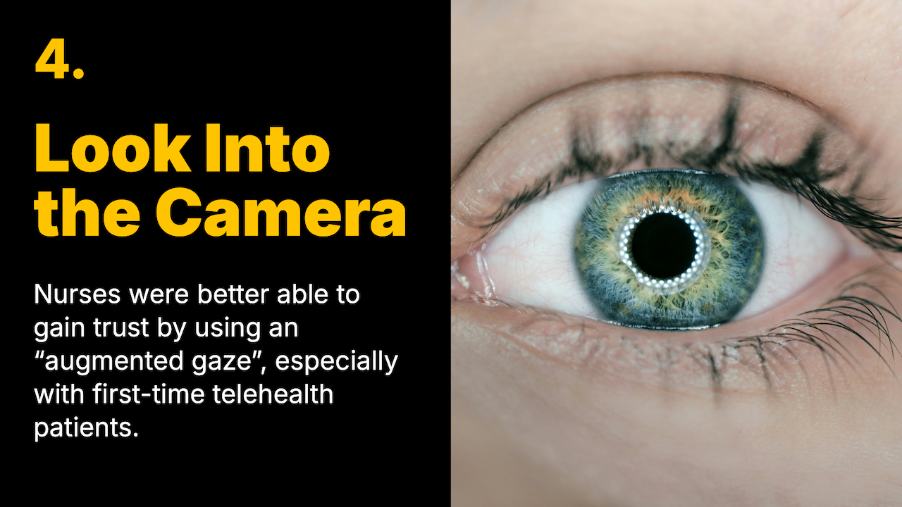
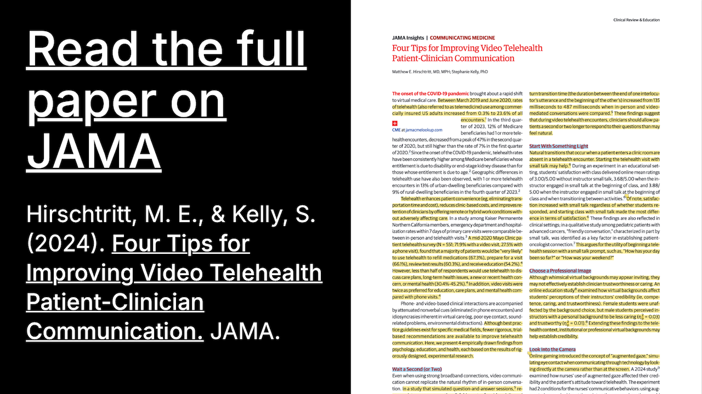

While telemedicine use has decreased slightly since the COVID pandemic, it is still much more common than it was before 2020.

Increasingly, patients—and clinicians—expect virtual calls as a convenient alternative, especially for visits where going to a clinic in person is not necessary. But, provider-patient communication via video calls is inherently different than face-to-face communication.

@hirschtrittFourTipsImproving2024 detail four tips to help providers gain their patients' trust and improve the telemedicine experience.

I wrote my [master's capstone paper](../advancing-msk-telemedicine) on what things telemedicine providers could learn from video game live streamers and YouTubers.

I reviewed a couple hundred articles, but couldn't find anyone making the same suggestions I was exploring, especially the idea of simulated eye contact by looking directly at the camera lens. I began to feel a lot of doubt, worrying that my idea was too niche, technical, or obscure to be considered in healthcare (as many of my ideas are!).

It was pretty validating that, less than a month after I submitted my capstone project, this article was published in JAMA.

@hirschtrittFourTipsImproving2024 highlight the concept of *augmented gaze*—looking directly into the camera lens to simulate eye contact, instead of looking at the computer screen—stating that this technique was introduced by online gaming. But the technique is much, much older than that… It has been practiced by on-screen professionals (e.g. news anchors) for decades.

*An historical image of Tom Brokaw demonstrates the augmented gaze in 1987.*

It can be awkward at first, but gets better with practice. Using a teleprompter to display the incoming video right in front of the lens can make this feel much more natural.
