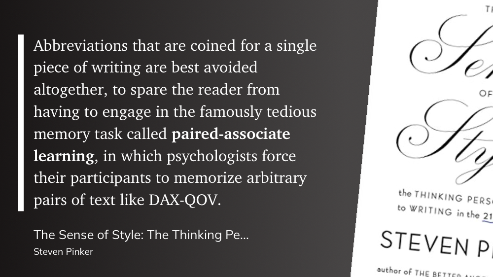
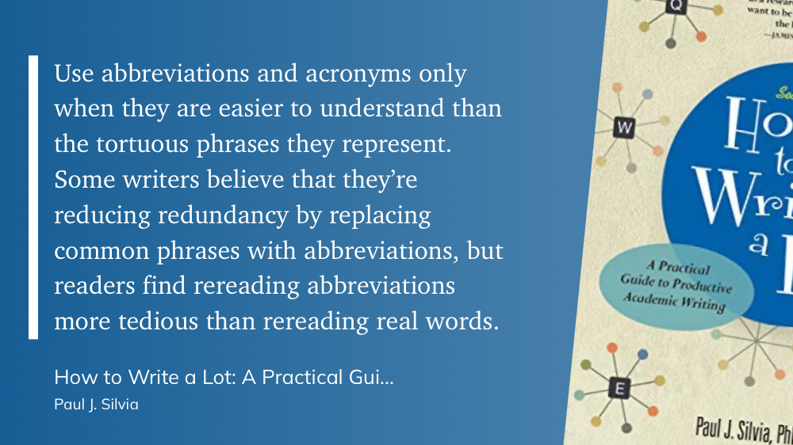

# Journal of Actually Well-written Science

I stumbled across [the blog](https://etiennefd.com/dgm/the-journal-of-actually-well-written-science/) of [EtienneFD](https://etiennefd.com)[^1] and noticed how well the ideas align with similar thoughts I've had about journals and publishing.

What first caught my eye, beyond the minimalistic theme, was the title of his most recent post–*‌[Platypus Paper, Rewritten](https://etiennefd.com/dgm/platypus-paper-rewritten/)*[^2] It's a proof of concept of his idea of "a science journal that focusses on readability."

> Science papers are boring. They’re boring even when they should be interesting. They’re awful at communicating their contents. They’re a chore to read. They’re work.

The poor readability of scientific articles is something that has bothered me for a while. Initially, I assumed I just wasn't smart enough to understand the complicated structure and jargon. But after learning about research, earning 3 advanced degrees, and reading hundreds, if not thousands, of peer-reviewed articles, I'm more confident in saying the standard practice in scientific publishing could use a rethink. Whether it's [poor typography](https://x.com/nathancashion/status/1752848499006427439) choices, or lack of a [coherent narrative](https://youtu.be/ZXJIgvfTPaM?si=PrF8JvcluJgScCjI&t=2451), authors and editors seem to intentionally make their academic work [harder to read](https://www.youtube.com/shorts/Vo_-qbrke7U).

Étienne began writing a series of scientific style guidelines outlining various ways papers could be made more readable. This led to starting JAWWS, a new journal of actually readable papers.[^3]

His article on [abbreviations](https://etiennefd.com/dgm/science-style-guide-abbreviations/) in scientific articles was particularly enjoyable as it confirmed a personal bias of mine against TLAs.[^4]

And Étienne is in good company. Steven Pinker argues that abbreviations should be avoided altogether.

Paul Sylvia, author of *How to Write More* agrees, adding that abbreviations are more tedious than reading the original words over and over.

While Étienne hasn’t written much lately[^5], Mike Morrison of #betterposter fame has started [a new journal](https://scienceux.org) from the same cloth—this one focused on better UX design in scientific publishing.

[^1]: While searching for arguments on parentheses vs. em dashes vs. footnotes, of all things.
[^2]: My son is obsessed with platypuses, so I just had to look through it.
[^3]: The [website](https://jawws.org) is no longer active, sadly.
[^4]: Three-Letter Acronyms
[^5]: I think he was a couple of years ahead of his time. And as it turns out, he is part of the team at [Elicit.com](https://elicit.com/?via=nathan), a tool that I find super helpful and used extensively during my master's program.